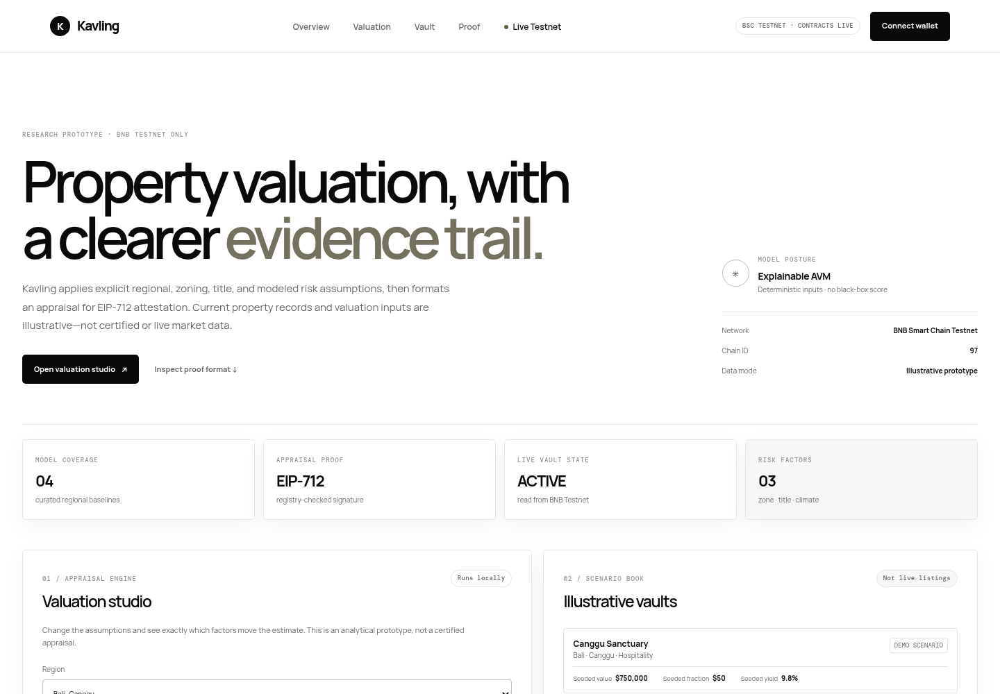
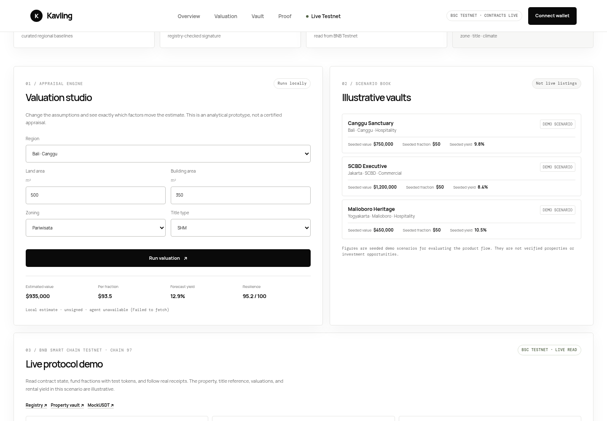
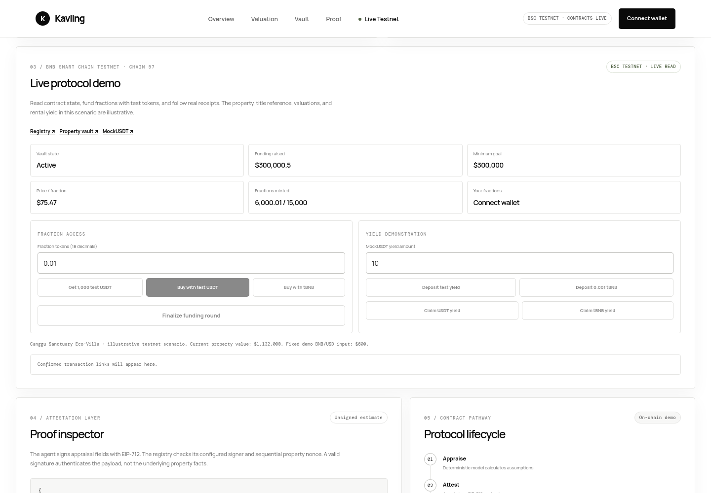
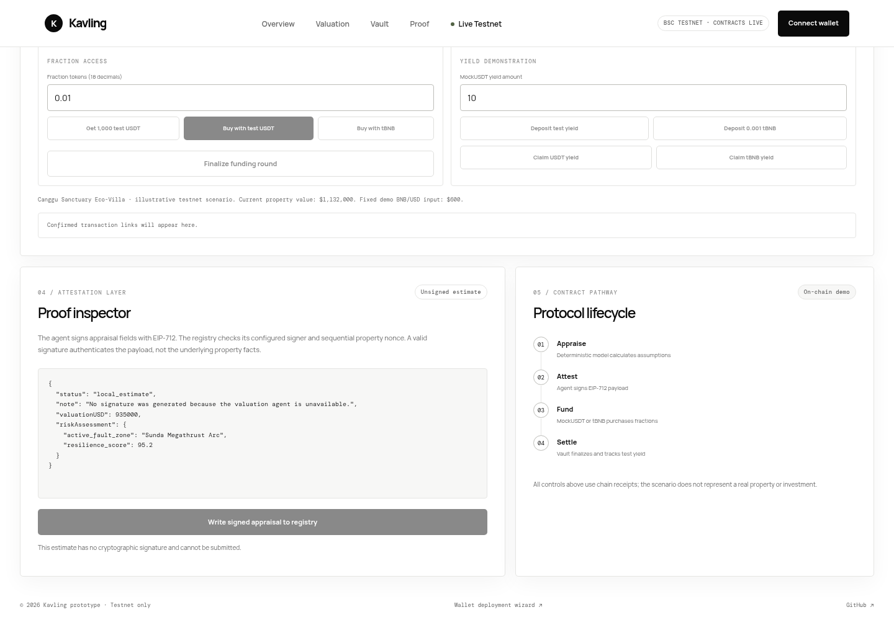
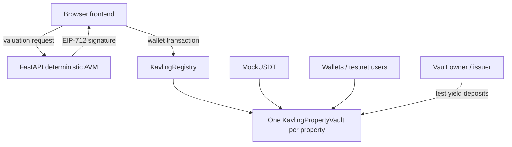

# Kavling AI

Kavling AI is a testnet prototype that turns an explainable Indonesian property valuation model into a signed appraisal and a fractional-vault workflow on BNB Smart Chain.

> **Prototype only.** The property, title references, market inputs, valuation, and yield are illustrative. Nothing here establishes real property ownership, legal title, investment availability, or rental income.

## Indonesia Web3 Hackathon 2026

- Tracks: AI Agents; Finance & Commerce
- Network: BNB Smart Chain Testnet (chain ID 97)
- Submission deadline: October 7, 2026
- Live app: [kavling-ai.vercel.app](https://kavling-ai.vercel.app)

## Product Preview

The live interface reads the deployed BNB Smart Chain Testnet vault; the valuation scenarios shown are explicitly illustrative.



<details>
<summary>Valuation studio, live testnet vault, and proof inspector</summary>







</details>

## The Problem

Property ownership is difficult to evaluate and access: evidence about location, use restrictions, title type, and regional risk can be fragmented, while direct ownership requires substantial capital. Kavling explores a transparent analysis and onchain record flow; it does not claim to solve title verification or make property fractions legally enforceable.

## The Solution

A FastAPI valuation agent applies explicit regional, zoning, building, title, and risk assumptions. It signs the resulting fields with EIP-712. A registry checks the configured signer, chain/domain, expiry, timestamp, and sequential property nonce. A separately deployed vault demonstrates fractional accounting, escrow, refunds, and test-token/native-test-BNB yield distribution.

## Why Indonesia

The model includes Indonesian city/district scenarios and recognizes that zoning, land-use permissions, title categories such as SHM, HGB, and Hak Pakai, and local climate/seismic exposure matter to property analysis. These are modeled inputs only: the prototype does not query land offices, RDTR/RTRW services, BMKG, flood feeds, or verified property records.

## Why BNB Chain

The prototype uses EVM contracts and EIP-712 signatures so a wallet can inspect and authorize a familiar typed-data workflow. BNB Smart Chain Testnet provides the deployed demonstration network; `MockUSDT` and tBNB are test assets with no monetary value.

## How It Works

1. Enter a scenario and assumptions in the valuation studio.
2. When a hosted agent is available, the Python service calculates a deterministic estimate and signs an appraisal payload; until then, the UI labels its local result **Unsigned local estimate**.
3. Connect an EVM wallet on BSC Testnet and submit the signed payload to the registry.
4. Use test assets to buy fractions in the linked property vault; the live panel reads state and links receipts.
5. The vault can demonstrate funding finalization and illustrative USDT/tBNB yield claims.

## Architecture



The deployment script creates one `MockUSDT`, one `KavlingRegistry`, registers the initial Canggu scenario, deploys one `KavlingPropertyVault`, and links it. The vault is not a factory: another property currently requires a separately deployed vault.

## AI Valuation Engine

The term “AI” describes an automated agent workflow; the current valuation engine is deterministic Python, not a trained model. It calculates land and building components using hard-coded/curated regional baseline tables, zoning and title multipliers, building assumptions, and hand-coded climate/seismic risk factors. Yield is a bounded formula. There are no live government, BMKG, property-market, title, or weather integrations, and no autonomous model training. The EIP-712 signature attests that the configured agent signed a payload; it does not prove that its facts are true.

## Smart Contracts

- `MockUSDT`: owner-mintable test token with an open faucet; not real USDT.
- `KavlingRegistry`: property records, appraiser authorization, EIP-712 verification, per-property sequential nonces, deadlines, and vault links.
- `KavlingPropertyVault`: one property’s fractional ERC-20 units, USDT/tBNB purchase paths, funding/escrow/refund states, and separate USDT/native-BNB reward accounting.

## 🔴 Live BSC Testnet deployment

Deployment source commit: [`42b7cd3`](https://github.com/Webghost01-NG/kavling-ai/commit/42b7cd3). The registry appraiser and deployment owner are the same public testnet address. The initial Canggu appraisal has since been updated onchain by the agent to nonce 2.

| Contract | Address | Deployment transaction | Explorer |
| --- | --- | --- | --- |
| MockUSDT | `0x8cd2DA9E45D18c47A803f065a3625AE68bF37B17` | [0x5f5fc6a9…afb0b](https://testnet.bscscan.com/tx/0x5f5fc6a9c8685f65f476a380801d8fe80f7f6108006a8c44949808dba97afb0b) | [Address](https://testnet.bscscan.com/address/0x8cd2DA9E45D18c47A803f065a3625AE68bF37B17) |
| KavlingRegistry | `0x0908E0409d593409D251306302FDca0C45198B9C` | [0x13d8b691…e243f](https://testnet.bscscan.com/tx/0x13d8b69132a59aed5b295b098813500ecc8318dd38239518f237b721d71e243f) | [Address](https://testnet.bscscan.com/address/0x0908E0409d593409D251306302FDca0C45198B9C) |
| KavlingPropertyVault · Canggu | `0xbb42F96B7Dd1FC127f7A9729C178EFE15ADa8F0a` | [0x65658872…f4266](https://testnet.bscscan.com/tx/0x656588721e738eaf7c2276334e7eba8217d6ebd78d237275afa7316697ff4266) | [Address](https://testnet.bscscan.com/address/0xbb42F96B7Dd1FC127f7A9729C178EFE15ADa8F0a) |

- Network: BNB Smart Chain Testnet · chain ID 97
- Deployer / configured appraisal signer: `0x6CeD8D6Bad8Dfd2e60BCEA116fE74548f959f1F2`
- Deployment time: 2026-10-02 21:04:46 UTC
- Source verification: all three contracts report `exact_match` through Sourcify (see [DEPLOYMENT.md](DEPLOYMENT.md)).

## Live Demo

[Open Kavling AI](https://kavling-ai.vercel.app). It reads live registry/vault/token data from BSC Testnet and submits transactions through the user's wallet. The canonical production branch is `main`. The FastAPI service is configured by [`render.yaml`](render.yaml), but no Render service is currently provisioned: the previously known Render host returns 404, and no Render account/API credentials are available in this environment. Accordingly, production valuation currently displays an explicitly unsigned local estimate. A local end-to-end API check against BSC Testnet succeeded with the appraiser key already configured in this machine's environment; this does not mean a hosted service is live.

## Judge Quickstart

1. Open the [live app](https://kavling-ai.vercel.app) and scroll to **Live protocol demo** to see deployed state without connecting a wallet.
2. Open **Valuation studio** and calculate the Bali/Canggu scenario. The deployed app currently produces an **Unsigned local estimate** because hosted Render activation and production `agentUrl` wiring remain pending. When activated, this step should show the hosted deterministic agent's EIP-712 proof, signer, nonce, and registry address.
3. For writes, connect a wallet configured for BSC Testnet (97), obtain tBNB from a faucet, request faucet MockUSDT, then buy a small fraction. Wallet prompts and confirmed BscScan transaction links appear in the page.
4. Review the registry/vault links above and this repository’s onchain evidence.

Do not treat testnet tokens, scenarios, or yield as investment assets or returns.

## Security

Registry checks the EIP-712 domain, configured appraiser, expiry, increasing timestamp, and sequential per-property nonce. The vault uses OpenZeppelin ERC20/Ownable/ReentrancyGuard/Pausable components, escrows funds until its goal is reached, and offers pro-rata refunds after an unsuccessful funding period. Reward accounting is settled around fractional balance changes; self-transfer double settlement is explicitly prevented and tested. Purchases stop after the funding deadline. This is an internal development review, **not an independent security audit**. The registry owner can change appraiser/compliance/property settings; the vault owner controls BNB/USD assumptions, pausing, and emergency token withdrawal. The issuer receives funds on finalization.

The app requests wallet access only after an explicit click; each write requires wallet confirmation. See [METAMASK_REVIEW.md](METAMASK_REVIEW.md) for the domain reputation review evidence. The warning is not cleared or endorsed by MetaMask.

## Testing

Latest complete run after the correctness fixes:

- Solidity: **12/12 tests passing**, including fuzzing (`test_Fuzz_BuyWithUSDT`, 256 runs).
- Python: **23/23 tests passing**, including health without a valid signer, fail-closed signing on appraiser mismatch, signature generation, and registry nonce handling.
- Frontend: JavaScript syntax checks passed. A local API run against BSC Testnet confirmed signer authorization, registry bytecode, CORS preflight, and a signed appraisal for the deployed property at nonce 3 (not broadcast). Production still shows an unsigned local estimate because Render is not provisioned and `agentUrl` remains intentionally empty. Wallet writes were not browser-tested with an interactive wallet in this environment.

Run locally:

```bash
cd contracts && forge build && forge test -vvv
cd .. && agent/.venv/bin/pytest agent/tests/ -q
node --check frontend/app.js
node --check frontend/deployment.js
```

## Onchain Evidence

Selected successful testnet transactions:

- [Register initial property](https://testnet.bscscan.com/tx/0x01fd23d693c0f48118cfa1f808c67fc1211f64bb9c1cb7c015cd7dea4c9ab104)
- [Link vault](https://testnet.bscscan.com/tx/0xddbce25f3dd446525bae453f9e75fe6b0b40799abaa8a9ac464d5960c99cb5ae)
- [Buy fractions with MockUSDT](https://testnet.bscscan.com/tx/0xe4a679c3abb2da19d9863b15c13ae3f1ee6cf3948609a246adacd2922ef443f9)
- [Finalize funding](https://testnet.bscscan.com/tx/0xb583e8ca21237c23aa464d29727757f3b306094de2b0d8ff40d04afde3fe1e52)
- [Deposit illustrative USDT yield](https://testnet.bscscan.com/tx/0x2483a006223ed37d309b1a699161e4d8f3960279a38a2c5336438fde25189eb5)
- [Update appraisal with agent EIP-712 signature](https://testnet.bscscan.com/tx/0x19d149fb12c7d9e124190ded89cead0b1be9b26046df3e30220ddb4734d821d5)

Additional approvals, native BNB purchases, and yield claim transactions are listed in [DEPLOYMENT.md](DEPLOYMENT.md). Onchain demo transactions used the deployment wallet for both issuer and investor, so the issuer’s proceeds returned to that same test wallet. The contracts were not exercised with independent users in this smoke run.

## Local Development

```bash
git clone https://github.com/Webghost01-NG/kavling-ai.git
cd kavling-ai
git submodule update --init --recursive
cd contracts && forge build && forge test -vvv
cd ../agent
python3 -m venv .venv
source .venv/bin/activate
pip install -r requirements.txt
uvicorn kavling.server:app --app-dir . --reload --port 8000
```

In another terminal, serve `frontend/` with a static HTTP server. To use the hosted agent locally, configure `AGENT_PRIVATE_KEY`, `REGISTRY_ADDRESS`, `CHAIN_ID=97`, `RPC_URL`, and `CORS_ORIGINS` through your local secret manager/environment. Never put secrets into tracked files or browser code.

## Deployment

The reproducible Foundry script and exact constructor values are documented in [contracts/README.md](contracts/README.md) and [DEPLOYMENT.md](DEPLOYMENT.md). It deploys a test-only token, registry, initial appraisal/property, and that property’s vault. Set `DEPLOYER_PRIVATE_KEY` in a secure environment, simulate first, and only broadcast from a disposable testnet wallet. Never commit or paste the key into a file.

## Repository Structure

- `contracts/`: Solidity protocol, Foundry tests, deployment script.
- `agent/`: FastAPI service, deterministic valuation/risk modules, EIP-712 signing, tests.
- `frontend/`: wallet-connected application, deployment console, browser ABI artifacts.
- `DEPLOYMENT.md`: receipt-derived deployment and smoke-test record.
- `SUBMISSION.md`: hackathon submission copy source.

## Current Prototype Boundaries

- One illustrative property is registered; title and IPFS strings are placeholders, not evidence.
- Regional pricing/risk/zoning assumptions are curated/hard-coded; no live official or market integrations are present.
- `MockUSDT`, tBNB, price inputs, property valuation, and yield deposits are test/demo-only.
- This does not tokenize legal ownership, perform KYC, prove regulatory compliance, verify title, or guarantee returns.
- Backend hosted signing is not yet provisioned. Render access is unavailable from this environment. The operator must create the Blueprint, set the signer key and registry address as private environment variables, deploy, and then wire the confirmed service URL into `frontend/deployment.js`.
- `main` is the canonical Vercel production branch; production redeployment after this release remains pending merge and deploy access.

## Roadmap

1. Provision and health-check the hosted signing service with a dedicated low-balance testnet key, then wire its confirmed URL and verify the production signed flow.
2. Add sourced, timestamped market/risk datasets and explicit provenance before changing model claims.
3. Obtain independent legal, property-data, and smart-contract reviews before any production or real-asset use.

## Hackathon Alignment

**AI Agents:** a Python service calculates an appraisal, reads the deployed property’s current nonce, signs EIP-712 data, and returns a payload that can be submitted to the registry. **Finance & Commerce:** BSC contracts demonstrate fractional purchase accounting, funding escrow/refunds, and test-asset yield claims. Both are prototype flows; neither establishes a real asset, income stream, or investment offering.

## License

MIT. See [LICENSE](LICENSE).
